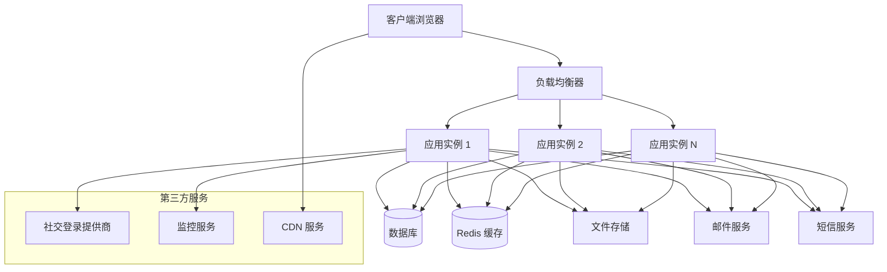
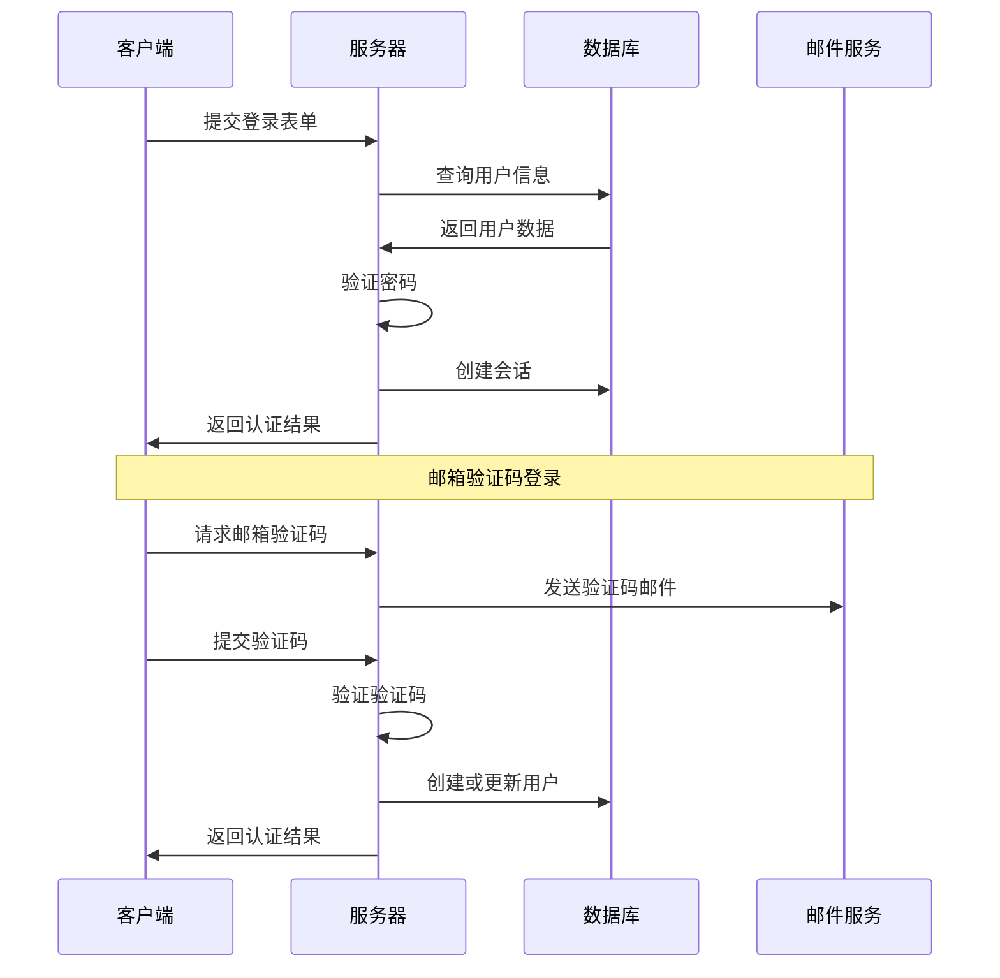
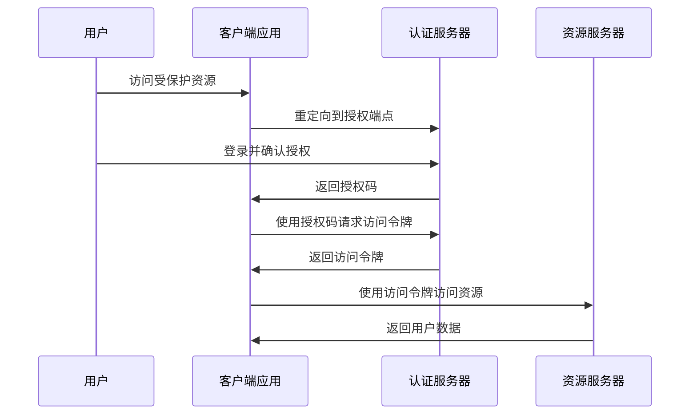

# 项目架构

草梅 Auth 采用现代化的全栈架构，基于 Nuxt.js 构建，提供完整的认证和用户管理解决方案。

## 技术栈

### 前端技术栈

- **Vue.js 3**: 渐进式 JavaScript 框架，使用 Composition API
- **Nuxt.js 3**: 基于 Vue.js 的全栈框架，提供 SSR、SSG 等功能
- **TypeScript**: 静态类型检查，提升代码质量和开发体验
- **SCSS**: CSS 预处理器，支持变量、嵌套等高级功能
- **Pinia**: Vue 状态管理库，替代 Vuex

### 后端技术栈

- **Nitro**: Nuxt.js 的服务器引擎，提供快速的服务端渲染
- **H3**: 轻量级、高性能的 HTTP 框架
- **TypeORM**: 强大的 ORM 框架，支持多种数据库
- **Better-Auth**: 现代化的认证库，支持多种认证方式

### 数据库支持

- **PostgreSQL**: 推荐的生产环境数据库
- **MySQL**: 广泛使用的关系型数据库
- **SQLite**: 轻量级数据库，适合开发和小型部署

### 部署和运维

- **Docker**: 容器化部署
- **Vercel**: 无服务器部署平台
- **Cloudflare Workers**: 边缘计算平台
- **传统 VPS**: Node.js 服务器部署

## 系统架构图



## 项目结构

### 目录结构

```
caomei-auth/
├── .nuxt/                  # Nuxt 构建输出
├── .output/               # 生产构建输出
├── components/            # Vue 组件
│   ├── auth-left.vue     # 认证页面左侧组件
│   ├── phone-input.vue   # 手机号输入组件
│   └── send-code-button.vue # 发送验证码按钮
├── composables/           # 组合式函数
│   └── use-clarity.ts    # Clarity 分析集成
├── layouts/               # 页面布局
│   ├── admin.vue         # 管理员布局
│   └── default.vue       # 默认布局
├── middleware/            # 中间件
│   └── auth.global.ts    # 全局认证中间件
├── pages/                 # 页面组件
│   ├── index.vue         # 首页
│   ├── login.vue         # 登录页
│   ├── register.vue      # 注册页
│   └── admin/            # 管理员页面
├── plugins/               # 插件
│   ├── clarity.client.ts # Clarity 客户端插件
│   └── sentry.ts         # Sentry 错误监控
├── server/                # 服务端代码
│   ├── api/              # API 路由
│   ├── database/         # 数据库配置
│   ├── entities/         # 数据实体
│   ├── middleware/       # 服务端中间件
│   └── utils/            # 服务端工具
├── styles/                # 样式文件
├── types/                 # TypeScript 类型定义
└── utils/                 # 客户端工具函数
```

### 核心模块

#### 1. 认证模块 (Auth)

```typescript
// server/api/auth/
├── sign-in.post.ts          # 用户登录
├── sign-up.post.ts          # 用户注册
├── sign-out.post.ts         # 用户登出
├── session.get.ts           # 获取会话信息
├── send-email-code.post.ts  # 发送邮箱验证码
└── send-phone-code.post.ts  # 发送手机验证码
```

#### 2. 用户管理模块 (User)

```typescript
// server/api/user/
├── profile.get.ts           # 获取用户资料
├── profile.patch.ts         # 更新用户资料
├── change-password.post.ts  # 修改密码
└── upload-avatar.post.ts    # 上传头像
```

#### 3. OAuth 模块

```typescript
// server/api/oauth/
├── authorize.get.ts         # OAuth 授权端点
├── token.post.ts           # 获取访问令牌
├── applications.get.ts     # 获取应用列表
└── consent.post.ts         # 用户授权确认
```

#### 4. 管理员模块 (Admin)

```typescript
// server/api/admin/
├── users.get.ts            # 获取用户列表
├── users/[id].patch.ts     # 更新用户信息
├── users/[id].delete.ts    # 删除用户
└── logs.get.ts             # 获取系统日志
```

## 数据流架构

### 1. 用户认证流程



### 2. OAuth 授权流程



## 安全架构

### 1. 认证安全

- **密码加密**: 使用 bcrypt 进行密码哈希
- **JWT 令牌**: 使用 JWT 进行会话管理
- **CSRF 保护**: 防止跨站请求伪造攻击
- **速率限制**: 防止暴力破解和 DDoS 攻击

### 2. 数据安全

- **输入验证**: 所有输入数据都经过严格验证
- **SQL 注入防护**: 使用 ORM 参数化查询
- **XSS 防护**: 输出数据自动转义
- **敏感数据加密**: 敏感信息加密存储

### 3. 通信安全

- **HTTPS 强制**: 生产环境强制使用 HTTPS
- **安全头部**: 设置安全相关的 HTTP 头部
- **同源策略**: 严格的 CORS 配置
- **Cookie 安全**: HttpOnly 和 Secure 属性

## 性能架构

### 1. 缓存策略

```typescript
// 多层缓存架构
interface CacheStrategy {
  browser: {
    static: '1y',      // 静态资源缓存
    api: '5m',         // API 响应缓存
    page: '1h'         // 页面缓存
  },
  cdn: {
    static: '30d',     // CDN 静态资源
    dynamic: '1h'      // CDN 动态内容
  },
  server: {
    redis: '24h',      // Redis 缓存
    memory: '5m'       // 内存缓存
  },
  database: {
    query: '1h',       // 查询结果缓存
    connection: 'pool' // 连接池
  }
}
```

### 2. 数据库优化

- **索引优化**: 关键字段建立索引
- **查询优化**: N+1 查询问题解决
- **连接池**: 数据库连接池管理
- **读写分离**: 主从数据库架构（可选）

### 3. 前端优化

- **代码分割**: 路由级别的代码分割
- **懒加载**: 组件和图片懒加载
- **Tree Shaking**: 移除未使用的代码
- **资源压缩**: Gzip/Brotli 压缩

## 监控架构

### 1. 应用监控

```typescript
// 监控指标
interface MonitoringMetrics {
  performance: {
    responseTime: number,    // 响应时间
    throughput: number,      // 吞吐量
    errorRate: number,       // 错误率
    availability: number     // 可用性
  },
  business: {
    userRegistrations: number,  // 用户注册数
    loginAttempts: number,      // 登录尝试数
    apiCalls: number,          // API 调用数
    activeUsers: number        // 活跃用户数
  },
  infrastructure: {
    cpuUsage: number,          // CPU 使用率
    memoryUsage: number,       // 内存使用率
    diskUsage: number,         // 磁盘使用率
    networkTraffic: number     // 网络流量
  }
}
```

### 2. 错误监控

- **Sentry 集成**: 自动错误收集和分析
- **日志聚合**: 结构化日志收集
- **告警系统**: 关键指标异常告警
- **性能监控**: APM 性能监控

### 3. 用户行为分析

- **Microsoft Clarity**: 用户行为热图
- **自定义埋点**: 关键业务指标跟踪
- **A/B 测试**: 功能效果测试
- **转化分析**: 用户转化漏斗分析

## 扩展架构

### 1. 水平扩展

- **负载均衡**: 多实例负载分发
- **无状态设计**: 服务无状态化
- **数据库分片**: 大数据量分片存储
- **微服务拆分**: 服务模块化拆分

### 2. 插件架构

```typescript
// 插件系统设计
interface PluginSystem {
  socialProviders: {
    register: (provider: SocialProvider) => void,
    list: () => SocialProvider[]
  },
  emailProviders: {
    register: (provider: EmailProvider) => void,
    list: () => EmailProvider[]
  },
  smsProviders: {
    register: (provider: SmsProvider) => void,
    list: () => SmsProvider[]
  },
  middleware: {
    register: (middleware: Middleware) => void,
    execute: (context: Context) => Promise<void>
  }
}
```

### 3. API 版本管理

- **版本控制**: URL 路径版本控制
- **向后兼容**: 保持 API 向后兼容
- **废弃策略**: 渐进式 API 废弃
- **文档同步**: 版本文档同步更新

## 部署架构

### 1. 容器化部署

```dockerfile
# 多阶段构建
FROM node:18-alpine AS builder
WORKDIR /app
COPY package*.json ./
RUN npm ci --only=production

FROM node:18-alpine AS runtime
WORKDIR /app
COPY --from=builder /app/node_modules ./node_modules
COPY . .
RUN npm run build
EXPOSE 3000
CMD ["npm", "start"]
```

### 2. 云原生部署

- **Kubernetes**: 容器编排和管理
- **Docker Compose**: 本地开发环境
- **Helm Charts**: Kubernetes 应用包管理
- **CI/CD Pipeline**: 自动化部署流水线

### 3. 无服务器部署

- **Vercel**: 静态站点和无服务器函数
- **Cloudflare Workers**: 边缘计算平台
- **AWS Lambda**: 函数即服务
- **Azure Functions**: 微软云函数服务

## 总结

草梅 Auth 采用现代化的全栈架构，具有以下特点：

1. **模块化设计**: 清晰的模块划分，便于维护和扩展
2. **安全优先**: 全面的安全防护措施
3. **高性能**: 多层缓存和性能优化
4. **可扩展**: 水平扩展和插件架构
5. **云原生**: 支持多种部署方式
6. **监控完善**: 全面的监控和分析体系

这种架构设计确保了系统的稳定性、安全性和可扩展性，能够满足从小型应用到大型企业级应用的各种需求。
